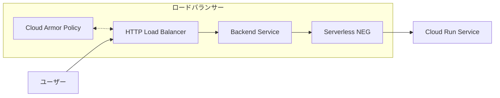
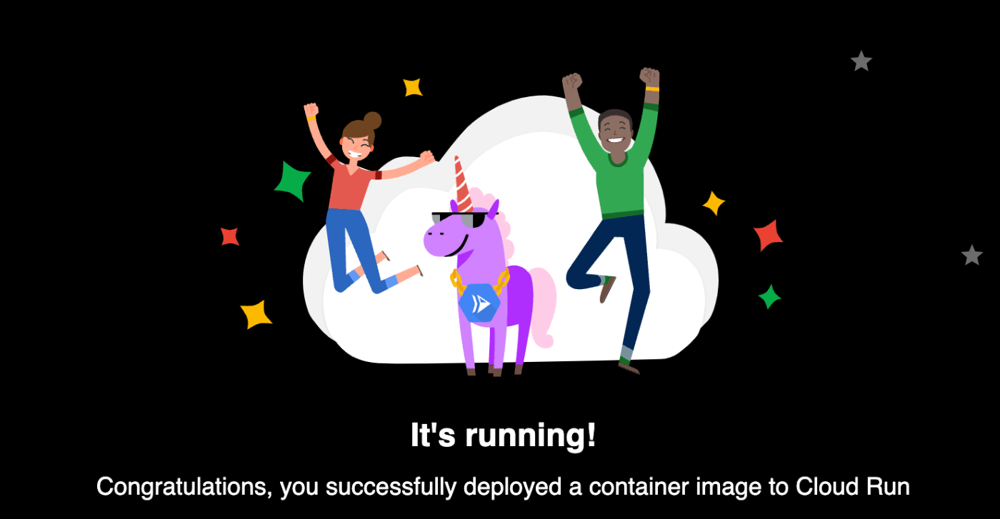

# 概要
Terraform を使用して Google Cloud Run にサンプルコンテナの hello アプリケーションをデプロイするリポジトリ  
ログインできるユーザーをメールアドレスで制限する。


# 構成図



# 許可するIPアドレスの設定

変更が必要な箇所としては、cloud armor policyのsrc_ip_rangesに自宅のグローバルIPを設定することです。
```terraform
# Load Balancerのcloud armor policy
resource "google_compute_security_policy" "hello_policy" {
  name        = "inference-policy"
  description = "Load Balancer用のcloud armor policy"
  rule {
    action   = "allow"
    priority = 1000
    match {
      versioned_expr = "SRC_IPS_V1"
      config {
        # FIXME: your ip address
        src_ip_ranges = ["YOUR_IP_ADDRESS"]
      }
    }
    description = "my home global ip address"
  }
  rule {
    action   = "deny(403)"
    priority = 2147483647
    match {
      versioned_expr = "SRC_IPS_V1"
      config {
        src_ip_ranges = ["*"]
      }
    }
    description = "default rule"
  }
  adaptive_protection_config {
    layer_7_ddos_defense_config {
      enable = true
    }
  }
}
```

自宅のPCのグローバルIPの調べ方は以下を参照しました。(mac)
https://qiita.com/rimorimo/items/8052bcfb32ac640a8796

# terraform実行
```shell
cd infra
terraform init
terraform plan
terraform apply
```

terraform planやterraform applyでvariablesの入力を求められるので、適切に入力します。
```shell
$ terraform plan
var.project
  The ID of the project in which resources will be managed.

  Enter a value:
```

※ロードバランサやCloud Armorの反映に少し時間がかかることがあります。

# アクセス
作成されたIPにアクセスします。
```shell
$ terraform output
load_balancer_ip = {IP_ADDRESS}
```

http://{IP_ADDRESS} にアクセス

以下の画面が出てきたら成功です！


# クリーンアップ
Terraformで作成したリソースをすべて削除して、環境をクリーンな状態に戻すには、以下のコマンドを実行します。
```shell
terraform destroy
```
