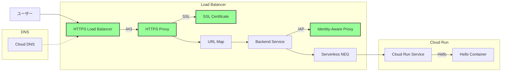
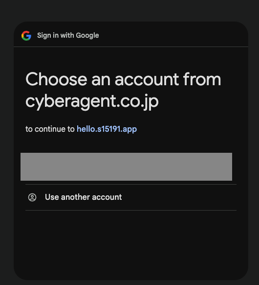
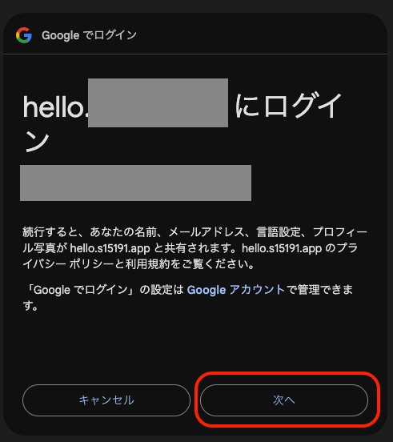

# 概要

Terraform を使用して Google Cloud Run にサンプルコンテナの hello アプリケーションをデプロイするリポジトリ  
ログインできるユーザーをメールアドレスで制限する。

# 構成図



# 変数の設定

`variables.tf`で以下の変数を環境に合わせて設定する必要があります：

```terraform
variable "project" {
  default = "your-project-id"    // GCPプロジェクトIDを設定
}

variable "project_number" {
  default = "your-project-number" // GCPプロジェクト番号を設定
}

variable "domain" {
  default = "your-domain.com"    // 使用するドメイン名を設定
}

variable "dns_managed_zone" {
  default = "your-dns-zone"      // Cloud DNSのゾーン名を設定
}

variable "iap_members" {
  default = [
    "user:example@example.com"   // IAPでアクセスを許可するユーザーのメールアドレスを設定
    // 複数のユーザーを追加可能
  ]
}
```

これらの値は、以下のいずれかの方法で設定できます：

1. `variables.tf`のデフォルト値を直接編集
2. `terraform.tfvars`ファイルを作成して値を設定
3. 環境変数で設定（例：`TF_VAR_project="your-project-id"`）
4. `terraform apply`実行時に対話的に入力

## terraform.tfvarsのサンプル

```terraform
# GCPプロジェクトの設定
project        = "your-project-id"        # プロジェクトID
project_number = "your-project-number"    # プロジェクト番号
region         = "asia-northeast1"        # リージョン

# ドメインとDNSの設定
domain           = "your-domain.com"      # 使用するドメイン
dns_managed_zone = "your-dns-zone"        # Cloud DNSのゾーン名

# IAPアクセス許可メンバー
iap_members = [
  "user:example@example.com",
  # 必要に応じて他のメンバーを追加
  # "user:another@example.com",
  # "group:team@example.com",
]
```

# terraform 実行

```shell
# ログイン
gcloud auth application-default login

cd infra
terraform init
terraform plan
terraform apply
```

注意：SSL 証明書のプロビジョニングと検証には時間がかかる場合があります（通常 15-30 分程度）。
証明書のステータスは以下のコマンドで確認できます：

```shell
terraform output certificate_status
```

# アクセス

以下のコマンドで、デプロイされた環境の情報を確認できます：

```shell
$ terraform output
certificate_status = {
  "create_time" = "2021-09-01T00:00:00.000-07:00"
  "expire_time" = "2021-12-01T00:00:00.000-07:00"
  "id" = "your-certificate-id"
}
domain = "your-domain.com"
lb_ip = "xxx.xxx.xxx.xxx"
url = "https://your-domain.com"
```

アプリケーションには `url` で表示された URL からアクセスできます。
なお、以下の点に注意してください：

- DNS の伝播に時間がかかる場合があります（通常 5-30 分程度）
- SSL 証明書の検証が完了するまで HTTPS アクセスができません
- 証明書のステータスは `terraform output certificate_status` で確認できます

Google のサインイン画面が表示されるので, 許可されたメールアドレスでサインインしてください.


ログイン画面で次へをクリックします.


以下の画面が表示されたら成功です！


# クリーンアップ

Terraform で作成したリソースをすべて削除して、環境をクリーンな状態に戻すには、以下のコマンドを実行します。

```shell
terraform destroy
```
